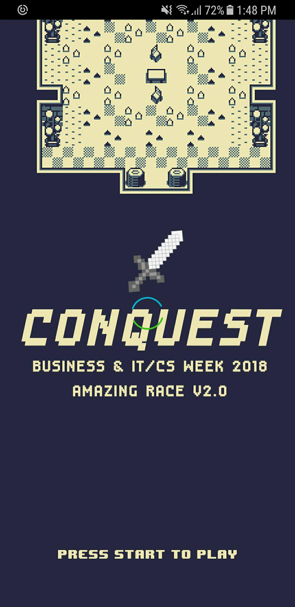
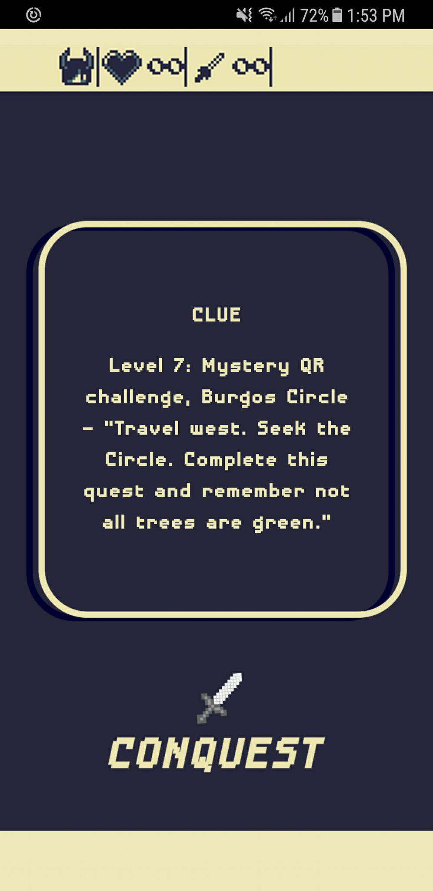
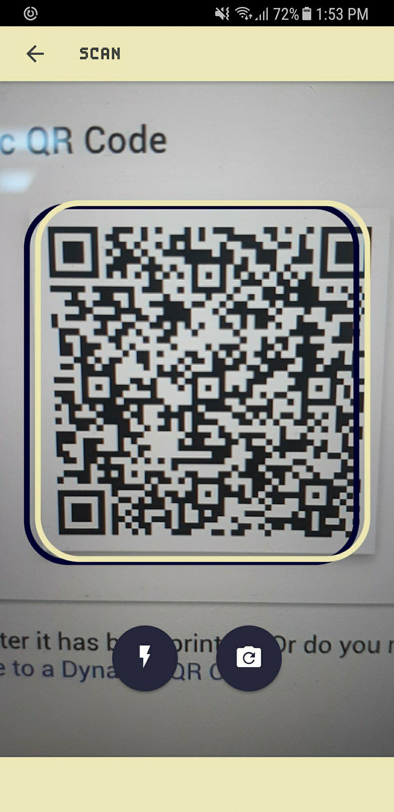
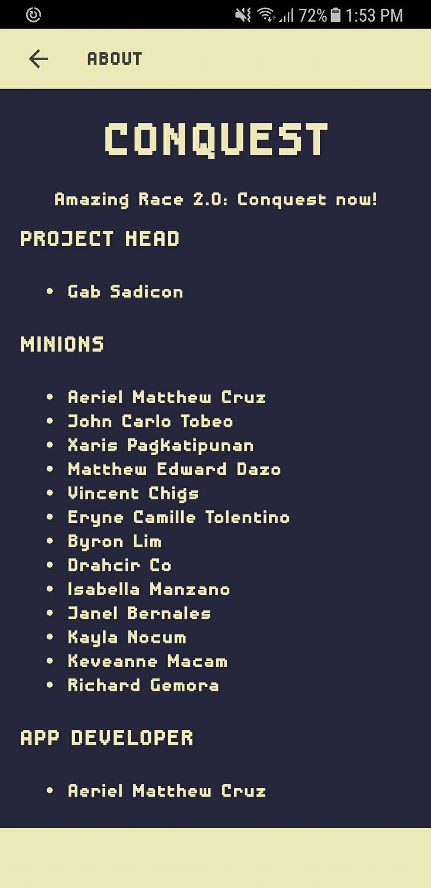

# conquest-scanner-app
A hybrid application made with Ionic Framework. The qr scanner app used in the MINT Amazing Race Event.
## EXPORT
''''
export JAVA_HOME=/Library/Java/JavaVirtualMachines/jdk1.8.0_161.jdk/Contents/Home/
export ANDROID_HOME=~/Library/Android/sdk/
''''

